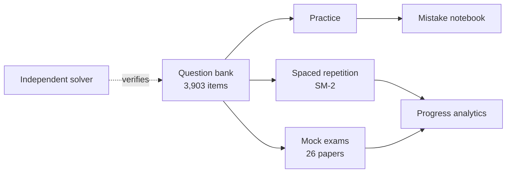

# Interactive README - build spec

_Companion to [`LANDING-PAGE-BRIEF.md`](./LANDING-PAGE-BRIEF.md). **§1 of that
brief applies here in full** - in particular, the private surface must not
appear in this README, its SVG endpoints, its alt text, or its commit history._

**Deliverable:** the `README.md` of the new public `vidya-landing` repo, made as
interactive as GitHub actually permits, backed by SVG endpoints served from the
same Vercel deployment.

---

## 1. What "interactive" can mean on GitHub - verified constraints

Most "interactive README" ideas fail because GitHub sanitises aggressively and
proxies every image. Build against reality:

### Works

| Technique | Notes |
| --- | --- |
| `<details>` / `<summary>` | **Real click interaction.** Officially supported. This is the backbone of the whole design. |
| Animated SVG via `` | SMIL and CSS animations *inside* the SVG do run. |
| Dynamically generated SVG | Served from a Vercel route handler; regenerated per request (with caveats - §1.3). |
| Mermaid code blocks | Natively rendered by GitHub. |
| `<picture>` + `prefers-color-scheme` | Proper dark/light asset swapping. |
| Anchor links / badges / tables / task lists | Standard. |
| Wrapping a whole image in a link | `[](target)` - works. |

### Does not work - do not design around these

| Technique | Why |
| --- | --- |
| `<script>` | Stripped. There is no JS in a README, ever. |
| `<style>` blocks, `class`, inline `style` in markdown | Stripped. (CSS *inside* an SVG file is fine.) |
| `<form>`, `<input>`, `<button>` | Stripped. No email capture in the README - link out. |
| `onclick` and all event attributes | Stripped. |
| **`<a>` inside an SVG loaded via ``** | Does **not** work. The SVG is a passive image. Wrap the whole image in a markdown link instead. |
| `:hover` inside an embedded SVG | Unreliable, and meaningless on touch. Never make content hover-only. |
| Iframes / embeds | Stripped. |

### 1.3 The Camo caching trap

Every external image is proxied through `camo.githubusercontent.com`, which
defaults to caching for **one year**. A "live" endpoint will silently freeze
unless handled.

**Mitigation, in order of reliability:**

1. **Pre-generate static SVGs via GitHub Actions** (most reliable). A scheduled
   workflow regenerates the SVG, commits it to the repo, and the README points
   at a repo-relative path. No proxy, no cache fight. **Use this for the stats
   badge.**
2. **Dynamic endpoint with aggressive no-cache headers.** Camo does respect
   them when set fully:
   ```
   Content-Type:  image/svg+xml
   Cache-Control: no-cache, no-store, max-age=0, must-revalidate, s-maxage=0, proxy-revalidate
   Pragma:        no-cache
   Expires:       0
   ```
   `no-cache` alone is reported not to be enough - send the whole set. Even
   then, expect occasional staleness of a minute or more.
3. Cache-busting query params or manual `curl -X PURGE` on the camo URL -
   last-resort manual tools, not a design.

**Design rule:** nothing in the README may be *wrong* if the image is a day
stale. A rotating question is fine stale; a "live user count" would not be
(and there are no users anyway - see brief §1.2).

---

## 2. README structure

```
┌ Banner SVG (animated, subtle)
├ One-line positioning + badges
├ ▸ Try a question right now        <- <details>, the hook
├ Three pillars (table)
├ Coverage at a glance (generated SVG, static via Actions)
├ ▸ What's actually built           <- <details>, honest status
├ ▸ How answers are verified        <- <details>, the moat
├ Architecture (Mermaid)
├ ▸ FAQ                             <- <details> × N
└ Links out to the landing page
```

### 2.1 The hook - a playable question in a README

The single most distinctive element. Uses `<details>` for genuine interaction:

```markdown
## Try one right now

**Goodwill · Hard · 4 marks**

> The profits of a firm for the last four years were Rs 90,000, Rs 1,20,000,
> Rs 1,40,000 and Rs 1,60,000. The profit of the second year included an
> abnormal gain of Rs 20,000, and the profit of the fourth year was arrived at
> after debiting an abnormal loss of Rs 16,000. Goodwill is to be valued at
> 3 years' purchase of the average adjusted profit. Calculate goodwill.

<details><summary><b>A</b> - Rs 3,82,500</summary>

That's the figure you get if you use the profits **as reported** and skip both
adjustments. The abnormal gain has to come out and the abnormal loss has to go
back in first.
</details>

<details><summary><b>B</b> - Rs 3,79,500</summary>

**Correct.**

1. Year 2 adjusted = 1,20,000 − 20,000 = **1,00,000** (abnormal gain removed)
2. Year 4 adjusted = 1,60,000 + 16,000 = **1,76,000** (abnormal loss added back)
3. Adjusted total = 5,06,000 → average = **1,26,500**
4. Goodwill = 1,26,500 × 3 = **Rs 3,79,500**
</details>

<details><summary><b>C</b> - Rs 3,85,500</summary>

You adjusted both years, but in the wrong direction - a gain is deducted and a
loss is added back, not the reverse.
</details>

<details><summary><b>D</b> - Rs 1,26,500</summary>

That's the average adjusted profit, which is right - but goodwill is that
figure × 3 years' purchase.
</details>
```

**Why this works:** each wrong answer teaches, because the distractors encode
real misconceptions. It is a genuine sample of the product, not a screenshot of
one. Rotate it periodically via the Actions workflow (§3), drawing from
`content/questions.sample.json`.

### 2.2 Coverage at a glance

A generated SVG bar/grid showing the 12 deep chapters against the 62 total,
matching the landing page's coverage grid. Static, regenerated by Actions.
Caption it honestly: *"12 chapters at full depth; the rest are being authored."*

### 2.3 Honest status block

Inside a `<details>`, a plain table of what is and isn't built - mirroring brief
§1.2. Publishing your own gaps in the README is on-brand and disarming.

### 2.4 Architecture - Mermaid

Renders natively, no image proxy involved:



---

## 3. Endpoints and automation

### 3.1 Vercel route handlers

| Route | Returns | Caching |
| --- | --- | --- |
| `/api/readme/stats` | Stats SVG (questions, chapters, mocks) | Prefer static via Actions; dynamic only with the §1.3 header set |
| `/api/readme/question` | Daily question card SVG | Dynamic, full no-cache headers |
| `/api/og` | OG image for the landing page | Standard caching is fine |

All SVGs must:
- embed fonts as paths or use a websafe stack - **no external font fetches**;
- contain no JavaScript;
- carry no links inside the SVG (§1.2);
- render legibly in both GitHub light and dark themes, or ship as a `<picture>` pair.

### 3.2 The refresh workflow

```yaml
# .github/workflows/refresh-readme.yml
name: Refresh README assets
on:
  schedule: [{ cron: "0 2 * * *" }]
  workflow_dispatch:
```

Regenerates the static SVGs and rotates the featured question, commits only if
bytes changed. Keep it dependency-light.

> ⚠️ The private repo's GitHub Actions has never successfully run a job
> (a billing/runner issue - see `BLUEPRINT.md` §-8). **Verify Actions actually
> runs in the new public repo before depending on this workflow.** If it
> doesn't, fall back to committing the SVGs manually and drop the "daily"
> language from the README.

---

## 4. Definition of done

- [ ] README renders correctly on github.com in **both** light and dark themes.
- [ ] Every `<details>` opens and closes; content is correct.
- [ ] Verified on the GitHub **mobile** web view - most `<details>`-heavy READMEs
      break there.
- [ ] No stripped tags: view the rendered HTML and confirm nothing was silently
      removed.
- [ ] SVGs legible at both desktop and mobile widths.
- [ ] Refresh workflow runs green at least once, or the fallback is documented.
- [ ] Stats in the README match `content/stats.generated.json` - no hand-typed
      numbers.
- [ ] **Grep the repo, the README and every SVG for private-surface terms; make
      it a CI step.**
- [ ] Alt text on every image; the README is readable with images disabled.
