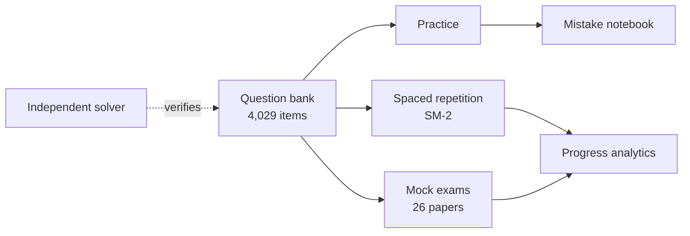

# Vidya — offline CBSE Commerce & Maths practice

> **Practice that works when your internet doesn't.**

---

## Try one right now

The interactive bit GitHub actually permits. **Each wrong answer teaches**,
because the distractors in the real bank encode real misconceptions.

**Goodwill · Hard · 4 marks**

> The profits of a firm for the last four years were Rs 90,000, Rs 1,20,000,
> Rs 1,40,000 and Rs 1,60,000. The profit of the second year included an
> abnormal gain of Rs 20,000, and the profit of the fourth year was arrived at
> after debiting an abnormal loss of Rs 16,000. Goodwill is to be valued at
> 3 years' purchase of the average adjusted profit. Calculate goodwill.

<b>A</b> — Rs 3,82,500

That's the figure you get if you use the profits **as reported** and skip both
adjustments. The abnormal gain has to come out and the abnormal loss has to go
back in first.

<b>B</b> — Rs 3,79,500

**Correct.**

1. Year 2 adjusted = 1,20,000 − 20,000 = **1,00,000** (abnormal gain removed)
2. Year 4 adjusted = 1,60,000 + 16,000 = **1,76,000** (abnormal loss added back)
3. Adjusted total = 5,06,000 → average = **1,26,500**
4. Goodwill = 1,26,500 × 3 = **Rs 3,79,500**

<b>C</b> — Rs 3,85,500

You adjusted both years, but in the wrong direction — a gain is deducted and a
loss is added back, not the reverse.

<b>D</b> — Rs 1,26,500

That's the average adjusted profit, which is right — but goodwill is that
figure × 3 years' purchase.

---

## Live stats

The image above is generated from `content/stats.generated.json` and served
from the Vercel deployment that hosts the landing page. The numbers in this
README are never hand-typed — they all come from the generated file.

---

## The three pillars

| | Pillar | What it means |
| --- | --- | --- |
| 1 | **Works with no internet** | The entire question bank lives on your phone. Nothing to download mid-session. |
| 2 | **Answers you can trust** | Every numeric answer is re-derived by an independent solver. If they disagree, the build fails. 0 duplicates, 0 integrity defects. |
| 3 | **Built for Commerce** | Accountancy and Maths are the deepest chapters here, not an afterthought bolted onto a science app. |

---

## Coverage at a glance

> **12 chapters at full depth; the rest are being authored.**

| State | Meaning |
| --- | --- |
| Exam-ready (300+ questions) | Each difficulty bucket (Easy / Medium / Hard) has 100+ questions |
| In progress | Authoring underway |
| Not started | Planned but no questions yet |

---

<b>What's actually built</b> — honest status

**Built:**
- Offline-first question bank
- Step-by-step verification pipeline
- Practice, spaced repetition, mocks, mistake notebook
- 10 commerce calculators, formula sheets, study planner
- This marketing site and interactive README

**Next:**
- Authoring the remaining chapters to exam depth
- Closed device + emulator testing on Android
- Public web build of the study app
- App store listing — once content and testing are both done

Vidya isn't on the Play Store yet. The app is built and the question bank is
real — you just answered from it — but we're finishing content depth and
device testing before release.

---

<b>How answers are verified</b> — the moat

Every numeric question is solved twice — once when it's written, and again by
a separate solver that reads only the question text and has no access to the
stored answer. If the two disagree, the build fails and nothing ships.

Wrong options aren't filler either: each one is a mistake students actually
make. In the Goodwill question above, the distractors correspond to:

| Option | Real mistake |
| --- | --- |
| A | Skipped both adjustments |
| B | **Correct** — both adjustments applied in the right direction |
| C | Applied both adjustments, both in the wrong direction |
| D | Forgot to multiply by years' purchase |

Nothing is labelled as a past paper unless its provenance is verified. PYQ
fabrication is structurally impossible.

---

## Architecture

---

<b>FAQ</b> — frequently asked questions

**Is this a real product?**
The app code exists and runs. The marketing site (this repo) is public; the
app source is private.

**Why isn't it on the Play Store yet?**
We're authoring the remaining chapters to exam depth and finishing device
testing first.

**How do you make sure answers are right?**
Every numeric answer is solved twice — by the author and by an independent
solver that never reads the stored answer. Disagreement fails the build.

**Does it work offline?**
The whole bank ships in the app. No network needed to study.

**What's the catch?**
55 of the 67 chapters aren't at exam depth yet. We tell you which ones are,
plainly — see the Coverage section above.

**Will my email be spammed?**
No. One email at launch, nothing else, ever. You can ask to be removed at
any time.

---

## Links

- **Landing page:** [vidya-landing-handoff.vercel.app](https://vidya-landing-handoff.vercel.app)
- **Daily sample question:** [`/api/readme/question`](https://vidya-landing-handoff.vercel.app/api/readme/question)
- **Stats SVG:** [`/api/readme/stats`](https://vidya-landing-handoff.vercel.app/api/readme/stats)

---

Numbers on this page are generated from <code>content/stats.generated.json</code>; nothing here is hand-typed.
